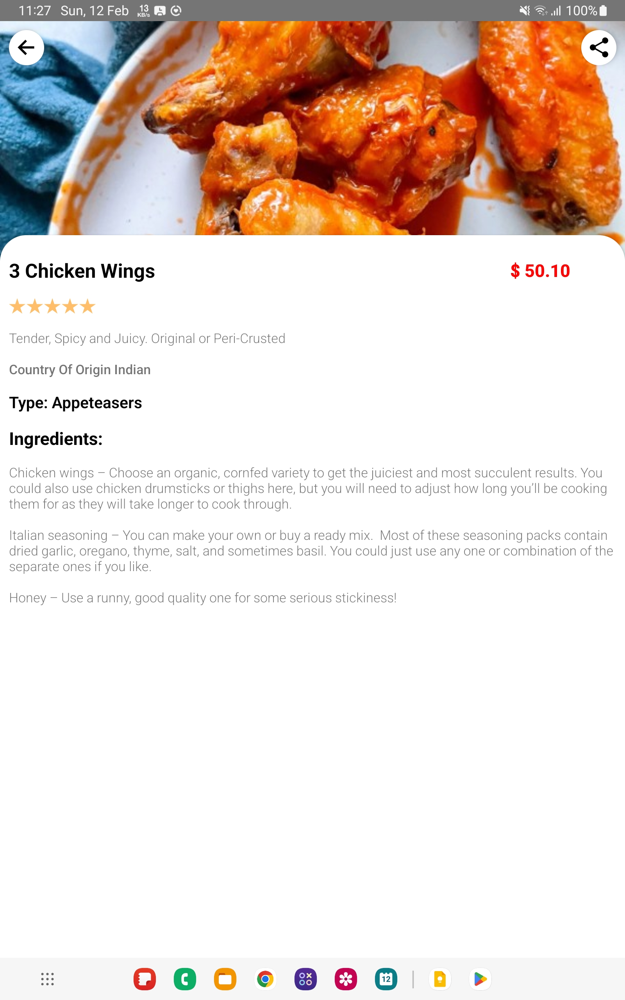

# Restaurant_App

#### Using DeepLinking for Menu Details Sharing -- When someone share a menu link and then clicking on that link same screen open in this app with all menu details

#### I am using Firebase Dynamic Links for DeepLinking

## Some Important Package

-   "@react-native-clipboard/clipboard": "^1.11.1",
-   "@react-native-firebase/app": "^17.1.0",
-   "@react-native-firebase/dynamic-links": "^17.1.0",
-   "@react-navigation/native": "^6.1.3",
-   "@react-navigation/native-stack": "^6.9.9",
-   "react-native-toast-message": "^2.1.5",
-   "react-native-vector-icons": "^9.2.0"

## Screenshots

